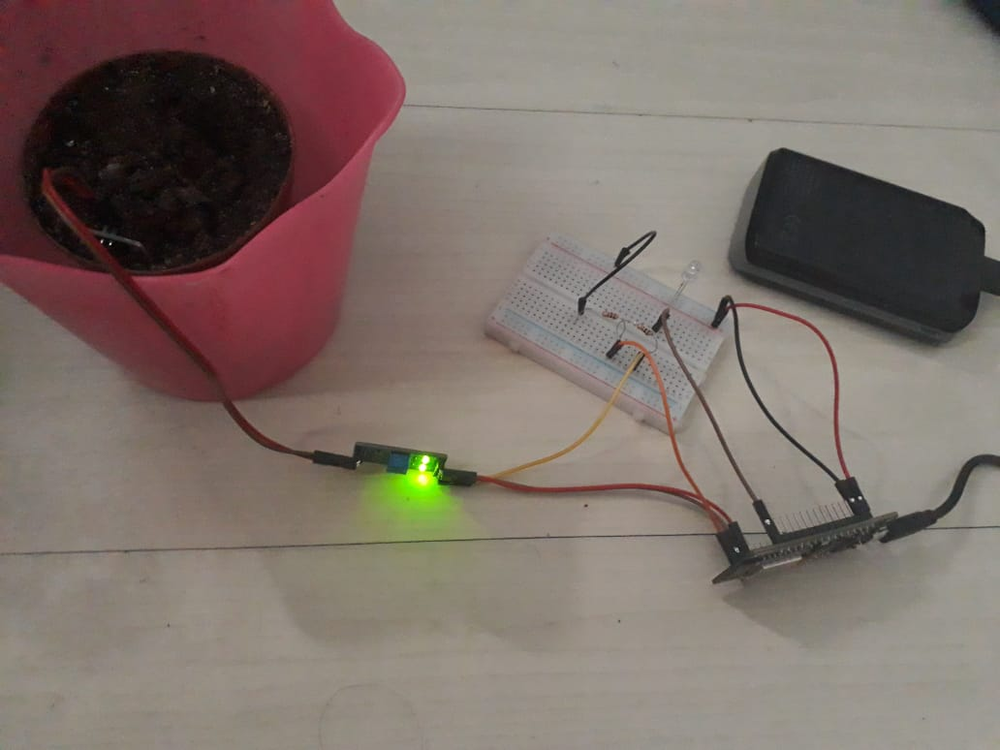

# HortaInteligente

Sistema criado para monitorar uma horta de forma inteligente.
O sistema conta com um aplicativo para celular, sensores e microcontroladores.

Tela do aplicativo criado:

Circuito montado:

  

